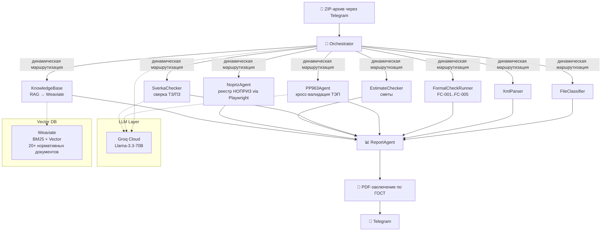

# МособлГосЭкспертиза — AI Document Expertise System

> **Problem:** Ручная экспертиза проектной документации в госорганах занимает 12–42 дня на один объект. Эксперт проверяет 12 разделов ПД вручную, сверяя с десятками нормативных документов (ПП РФ №963, №154, XSD-схемы).
>
> **Solution:** Мульти-агентная система из 8 AI-агентов с оркестратором на Llama-3.3-70B, RAG-пайплайном на Weaviate (гибридный BM25 + vector search) и автоматической валидацией по XSD-схемам.
>
> **Outcome:** Время экспертизы одного комплекта ПД сокращено с 12–42 дней до 5–10 минут. Обработано 100+ реальных комплектов документации в production для МосОблГосЭкспертизы (2024–2026).

### Key Metrics
| Metric | Value |
|---|---|
| Время экспертизы (до) | 12–42 дня |
| Время экспертизы (после) | 5–10 минут |
| Разделов ПД за прогон | 12 |
| Формальных проверок (FC) | 5 (FC-001..FC-005) |
| Комплектов в production | 100+ |
| Нормативных документов в RAG | 20+ |
| Агентов в системе | 8 |
| LLM | Llama-3.3-70B (Groq Cloud) |

### Architecture



### Tech Stack


### 📋 Описание проекта
📄 [Подробное описание проекта (PDF)](https://drive.google.com/file/d/1qvp4fEAjbX9im9-FAn11C73hj489kOIL/view?usp=sharing)

---

## 🚀 Быстрый старт

```bash
# 1. Клонировать
git clone git@github.com:14Segun88/moge-document-expertise-ai.git
cd moge-document-expertise-ai

# 2. Установить (создаст venv, установит зависимости, поднимет Weaviate)
chmod +x install.sh && ./install.sh

# 3. Заполнить ключи
nano .env   # BOT_TOKEN, GROQ_API_KEY, ADMIN_TELEGRAM_ID

# 4. Запустить бота
./start.sh
```

### Требования
- **ОС:** Ubuntu / WSL2
- **Python:** 3.10+
- **Docker:** для Weaviate (векторная БД)
- **LM Studio** (Windows): модель `nomic-embed-text` для RAG-эмбеддингов
- **API-ключи:** Groq (бесплатно на console.groq.com), Telegram Bot Token

---

## 📁 Структура проекта

### Ядро системы

| Файл | Назначение |
|------|-----------|
| `bot.py` | **Telegram-бот** — точка входа. Принимает ZIP, запускает пайплайн, отправляет отчёт |
| `start.sh` | Скрипт запуска бота (проверяет Weaviate, LM Studio) |
| `install.sh` | Автоустановка проекта на новый ПК |
| `docker-compose.yml` | Docker-контейнер Weaviate (векторная БД) |
| `.env.example` | Шаблон конфигурации (ключи, порты) |
| `requirements.txt` | Python-зависимости |


### Агенты (src/agents/)

| Файл | Агент | Что делает |
|------|-------|-----------|
| `src/agents/groq_client.py` | LLM-клиент | Round-Robin балансировка ключей Groq, вызов llama-3.3-70b |
| `src/agents/orchestrator/orchestrator.py` | Оркестратор | Маршрутизация: какой агент обрабатывает какой файл |
| `src/agents/document_analyzer/file_classifier.py` | Классификатор | Разбор ZIP, определение типа файлов (PDF/XML/SIG) |
| `src/agents/document_analyzer/xml_parser.py` | XML-парсер | Извлечение ТЭП, метаданных из XML Пояснительной записки |
| `src/agents/document_analyzer/formal_check_runner.py` | Формальные проверки | FC-001..FC-007: XSD, ИУЛ, комплектность, DPI сканов |
| `src/agents/document_analyzer/estimate_checker.py` | Сметная проверка | Проверка ССР (утверждение застройщиком, наличие ЛСР/ОСР) |
| `src/agents/compliance/pp963_agent.py` | ПП РФ №963 | Кросс-валидация ТЭП, проверка разделов ПД |
| `src/agents/compliance/pp154_agent.py` | ПП РФ №154 | Проверка теплоснабжения (промышленные объекты) |
| `src/agents/compliance/sverka_checker.py` | Сверка ТЗ/ПЗ | Сравнение техзадания с ПЗ по таблице критериев |
| `src/agents/knowledge_base/agent.py` | База знаний (RAG) | Поиск нормативов в Weaviate по тексту документов |
| `src/agents/knowledge_base/server.py` | RAG-сервер | FastAPI-сервер для Knowledge Base |
| `src/agents/external_integration/nopriz_agent.py` | НОПРИЗ | Проверка ГИП в реестре НОПРИЗ (Playwright) |
| `src/agents/reporting/report_agent.py` | Генератор отчёта | PDF-заключение по ГОСТ Р 7.0.97-2016 |

### RAG / Векторный поиск

| Файл | Назначение |
|------|-----------|
| `rag_crawler.py` | Скачивание нормативных документов с cntd.ru |
| `rag_indexer.py` | Нарезка на чанки + загрузка в Weaviate |
| `rag_search.py` | Гибридный поиск (BM25 + Vector) по нормативке |
| `rag_ask.py` | CLI-инструмент: задай вопрос → получи ответ с RAG |
| `project_search.py` | Поиск + ответ 70B Groq по проектной базе |

### API / Пайплайн

| Файл | Назначение |
|------|-----------|
| `src/api/pipeline.py` | Оркестрация полного цикла проверки |
| `src/api/router.py` | FastAPI-роутер (REST API) |
| `src/api/schemas.py` | Pydantic-модели запросов/ответов |
| `src/api/task_store.py` | Хранилище задач в памяти |
| `src/main.py` | Точка входа FastAPI (uvicorn) |

### База данных

| Файл | Назначение |
|------|-----------|
| `src/db/models.py` | SQLAlchemy-модели (DisagreementLog — HITL) |
| `src/db/database.py` | Подключение к SQLite |
| `src/db/inject_precedent.py` | Загрузка решений HITL в Weaviate |
| `src/db/init_db.py` | Инициализация таблиц |

### XSD-схемы

| Файл | Назначение |
|------|-----------|
| `xsd/explanatorynote-01-05.xsd` | XSD-схема ПЗ v01.05 |
| `xsd/explanatorynote-01-06.xsd` | XSD-схема ПЗ v01.06 (текущая) |
| `xsd/*.xsl` | XSLT-трансформации для визуализации |

### XML-компаратор (xml_comparator/)

| Файл | Назначение |
|------|-----------|
| `xml_comparator/app/` | Микросервис сравнения XML-документов ПЗ |
| `xml_comparator/mapping_PZ_ZnP.json` | Маппинг полей ПЗ → замечания эксперта |
| `xml_comparator/Dockerfile` | Docker-образ микросервиса |

### Тестирование (tests/)

| Файл | Назначение |
|------|-----------|
| `tests/test_first_page.py` | Сверка титульных листов PDF (детерминированный алгоритм) |
| `tests/test_monitor.sh` | 4-шаговый тестовый стенд (raw → expert → fixed → final) |
| `tests/test_api.py` | Unit-тесты API |
| `tests/test_document_analyzer.py` | Тесты классификатора документов |
| `tests/test_e2e_pipeline.py` | E2E-тесты пайплайна |

### Fine-tuning (QLoRA)

| Файл | Назначение |
|------|-----------|
| `train/generate_dataset.py` | Генерация Q&A датасета из Weaviate-чанков |
| `train/finetune.py` | QLoRA fine-tuning через Unsloth (Qwen2.5-3B → GGUF) |
| `train/dataset.jsonl` | Сгенерированный датасет |

> **Status:** Full training pipeline implemented and tested (dataset generation → QLoRA 4-bit → GGUF export). Not yet trained on production data due to GPU constraints (requires GTX 1650+ / 4GB VRAM). Currently using Groq Cloud API (Llama-3.3-70B) for production inference.

### Вспомогательные утилиты (tools/)

| Файл | Назначение |
|------|-----------|
| `tools/compare_with_expert.py` | Сравнение бот-отчёта с заключением эксперта |
| `tools/parse_conclusion.py` | Парсинг экспертного PDF-заключения |
| `tools/split_zip.py` | Разрезание ZIP по частям |
| `tools/read_docx.py` | Извлечение текста из DOCX |
| `tools/nopriz_login.py` | Авторизация в НОПРИЗ (Playwright) |
| `tools/_generate_drawio.py` | Генерация блок-схем (Draw.io) |
| `tools/mark_drawio.py` | Разметка блок-схем статусами ✅/🟡/❌ |

### Документация (docs/)

| Файл | Назначение |
|------|-----------|
| `docs/Структура работы приемки.drawio` | Блок-схема процесса приемки |
| `docs/Пайплайн работы с замечаниями.drawio` | Блок-схема работы с замечаниями |
| `docs/Чек-листы (2) (1).pdf` | Чек-листы экспертизы |
| `docs/АВТОМАТИЗИРОВАННАЯ СИСТЕМА ЭКСПЕРТИЗЫ ДОКУМЕНТАЦИИ.docx` | ТЗ на систему |

---

## ❌ Что НЕ попало в репозиторий (.gitignore)

| Файл/папка | Причина |
|---|---|
| `.env` | **Секреты** (API-ключи Groq, Telegram-токен) |
| `.venv/` | Виртуальное окружение Python (~500 МБ) |
| `Test/` | Тестовые ZIP-архивы (~600 МБ) |
| `real_docs/` | Реальные документы заказчика |
| `hitl_database.db` | Локальная SQLite-база прецедентов |
| `ResyltatTesta/` | Сгенерированные MD-отчёты тестирования |
| `*.log` | Логи работы бота |
| `__pycache__/` | Кэш Python |
| `_parsed_docs.txt` | Парсинг документов (~1.5 МБ) |
| `*:Zone.Identifier` | Системные файлы Windows |

---

## 📜 Лицензия

Проприетарное ПО. Все права защищены.
